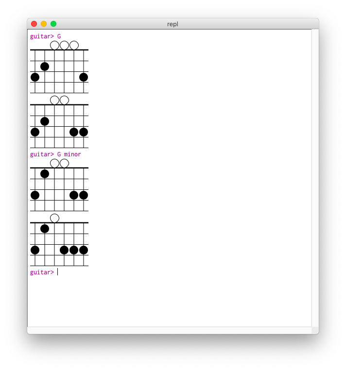

# racket-gui-repl-example
Example building a REPL gui using the Racket framework library.  This basic example uses the [alexknauth-music](https://pkgs.racket-lang.org/package/alexknauth-music) package to render chord charts for guitar fingering.

